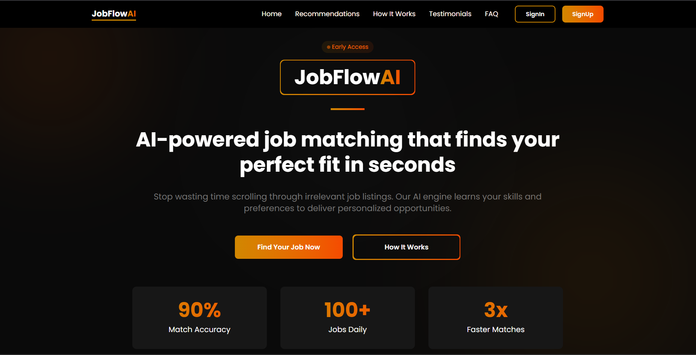

# JobFlowAI

JobFlow AI is a modern job recommendation platform that leverages AI and vector-based similarity search to deliver smarter, more relevant job suggestions tailored to individual preferences.

## Core Features:

• **Web Scraping** – Collects real-time job listings from various sources

• **Vector Embeddings** – Transforms job descriptions and user inputs into embeddings for meaningful comparison

• **Similarity Search** – Matches users with jobs based on semantic relevance, not just keywords

## Why It’s Different:

JobFlow AI goes beyond traditional keyword matching. By using AI and similarity search, it understands context and finds jobs that truly align with what users are looking for.


## Tech Stack

**TurboRepo**

**NextJs**

**TanStack Query**

**Puppeteer**

**BcryptJs**

**Gsap**

**Framer Motion**

**NeonDB**

**Drizzle ORM**

**Resend**

**Open AI**

**Rabbit MQ**

**ShadCN UI**

**Zod**


## Screenshots




## Run Locally

Clone the project

```bash
git clone https://github.com/sourav-bhowal/JobFlowAI.git
```
Go to the project directory
```bash
cd JobFlowAI
```
Put envs in .env file
```bash
cd apps/web
```
```bash
AUTH_SECRET=""
AUTH_URL=""
CRON_SECRET=""
NEXT_PUBLIC_VERCEL_ENVIRONMENT=""
OPENAI_API_KEY=""
RESEND_API_KEY=""
DATABASE_URL=""
RABBITMQ_URL=""
```
Install the dependencies
```bash
cd ../..
```
```bash
bun install
```
Run the frontend
```bash
bun run dev
```

